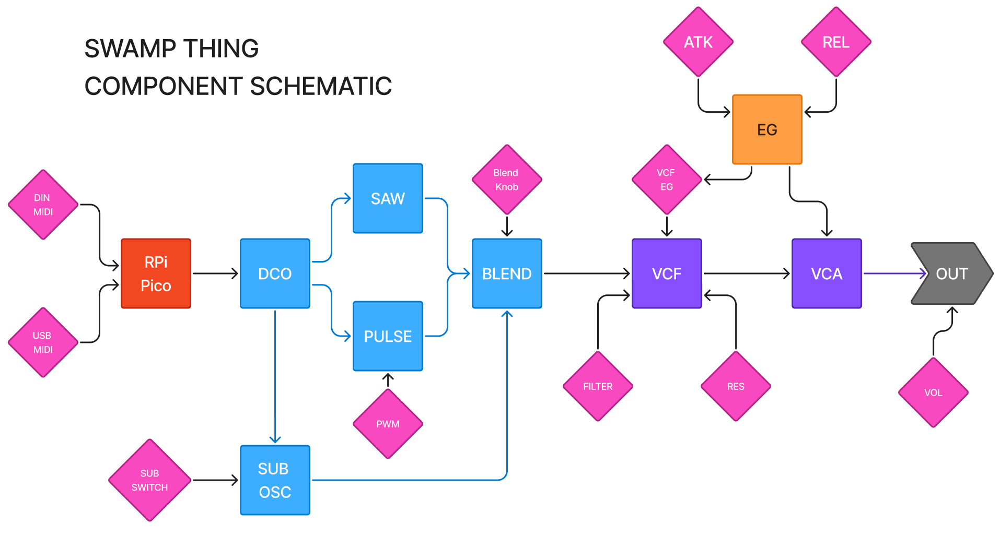
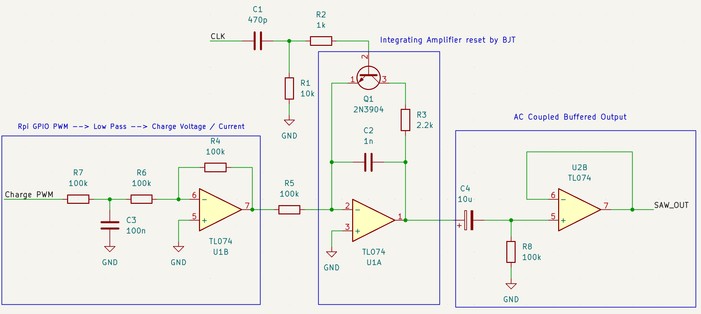

# SwampThing
Beginning of a Juno-106 inspired DCO monosynth for UF AES. Built around Raspberry Pi Pico Microcontroller.

### **Project Status**
| Component         | Designed  | Prototyped  | PCB / Finalized |
| -----             | --------  | ----------- | --------------- |
| DCO Saw-core      | X         | X           |                 |
| DCO Pulse / PWM   | X         | X           |                 |
| DCO SUB           | X         |             |                 |
| Blend             | X         |             |                 |
| MIDI USB          |           |             |                 |
| MIDI DIN          |           |             |                 |
| VCF               |           |             |                 |
| EG                |           |             |                 |
| VCA               |           |             |                 |
| Power Solution    |           |             |                 |
| Output            |           |             |                 |

## Table of Contents
- [Component Diagram](#component-diagram)
- [Installation / Build](#installation--build)
  - [Prereqs](#prereqs)
  - [Build Steps](#build-steps)
  - [Quick Build & Flash](#quick-build--flash)
  - [Manual Flashing](#manual-flashing)
  - [Notes](#notes)
- [Architecture](#architecture)
  - [MIDI I/O (DIN & USB)](#midi-din--usb)
  - [DCO (Core Oscillator)](#dco-core-oscillator)
    - [SAW](#saw)
    - [PULSE / PWM](#pulse--pwm)
    - [SUB OSC](#sub-osc)
  - [Power Solution](#power---12v-5v)
- [Incomplete BOM](#incomplete-bom)

## Component Diagram:


## Installation / Build

### Prereqs
- [VS Code](https://code.visualstudio.com/)
- [Raspberry Pi Pico VS Code Extension](https://marketplace.visualstudio.com/items?itemName=raspberry-pi.raspberry-pi-pico)

### Build Steps
1. Clone this repo
2. Open the `src` folder in VS Code (not the root folder!)
3. Open a PowerShell terminal in VS Code
4. Run:
```powershell
mkdir build
cd build
cmake -G "Ninja" ..
cmake --build .
```
5. The `.uf2` file will be in `build/SwampThing.uf2`

### Quick Build & Flash
- Press `Ctrl+Shift+B` to build and flash in one step - nifty!

### Manual Flashing
1. Hold BOOTSEL on your Pico and plug it in
2. Drag `SwampThing.uf2` onto the Pico drive

### Notes:
- Clock output: GPIO 13
- CV output: GPIO 14

## Architecture
### MIDI (DIN & USB):
*Currently In Development*

### DCO (Core Oscillator):
---

#### SAW
Juno-style ramp core. A TL074 op-amp integrator generates a rising ramp, NPN transistor reset discharges the timing capacitor at a rate set by the microcontroller clock. Pitch is set by the reset clock (GPIO 13). Ramp slope is set by a PWM-derived charge voltage filtered to DC (GPIO 14).

#### PULSE / PWM
Saw --> Comparator, threshold = PWM

#### SUB OSC
OSC --> Flip Flop, halves frequency

### Power Solution:
---
*Currently In Development*

 Presently planning +/- 12V, 5V rails.

## Incomplete BOM:

| PART              | QTY       | NOTE              |
| -----             | --------  | -----------       |
| Raspberry Pi Pico | 1         | Micrcontroller    |
| TL074             | 1         | 4x Op Amp         |
| 2N3904 NPN BJT    | 1         | Reset Transistor  |       